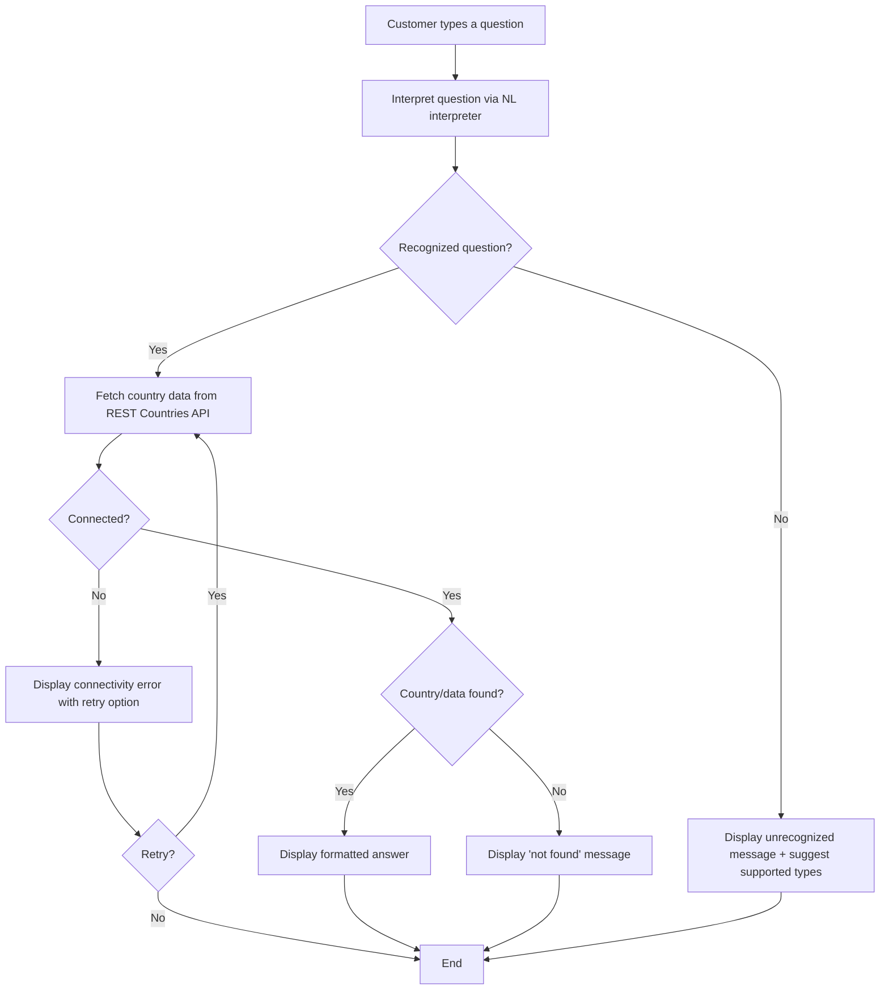

# Country Quiz — Case Study

A chat-like quiz application where users ask country-related questions in natural language, and the app replies with accurate answers. Built as **two separate apps** — a CLI app and an iOS app — sharing a reusable, modular core.

## Features

The apps support four types of questions (in any phrasing, even with typos):

| Question Type | Example |
|---|---|
| Capital of a country | "What is the capital of Belgium?" |
| Countries starting with letters | "Which countries start with CH?" |
| ISO alpha-2 country code | "What is the ISO alpha-2 country code for Greece?" |
| Flag of a country | "What is the flag of Brazil?" |

**Data source**: [REST Countries API](https://restcountries.com)

---

## BDD Specs

### Story: Customer Asks About a Country's Capital

**Narrative #1**

```
As an online customer
I want to ask about a country's capital in natural language
So I can quickly learn the capital of any country
```

**Scenarios (Acceptance criteria)**

```
Given the customer has connectivity
  And the customer types a question about a country's capital (e.g., "What is the capital of Belgium?")
When the app interprets the question
Then the app should fetch the country data from the remote API
  And display the capital (e.g., "The capital of Belgium is Brussels.")
```

```
Given the customer has connectivity
  And the customer types a question about a country that does not exist (e.g., "What is the capital of Atlantis?")
When the app interprets the question
Then the app should display a message indicating no matching country was found
```

```
Given the customer does not have connectivity
When the customer asks about a country's capital
Then the app should display a connectivity error with a retry option
```

---

### Story: Customer Asks Which Countries Start With Specific Letters

**Narrative #1**

```
As an online customer
I want to ask which countries start with given letters
So I can discover countries by their name prefix
```

**Scenarios (Acceptance criteria)**

```
Given the customer has connectivity
  And the customer types a question about countries starting with letters (e.g., "Which countries start with CH?")
When the app interprets the question
Then the app should fetch the matching countries from the remote API
  And display the list of matching country names (e.g., "Chad, Chile, China, Christmas Island")
```

```
Given the customer has connectivity
  And no countries match the given prefix (e.g., "Which countries start with ZZZ?")
When the app interprets the question
Then the app should display a message indicating no countries were found matching that prefix
```

```
Given the customer does not have connectivity
When the customer asks which countries start with specific letters
Then the app should display a connectivity error with a retry option
```

---

### Story: Customer Asks for the ISO Alpha-2 Country Code

**Narrative #1**

```
As an online customer
I want to ask for a country's ISO alpha-2 code
So I can get the standardized two-letter country identifier
```

**Scenarios (Acceptance criteria)**

```
Given the customer has connectivity
  And the customer types a question about a country code (e.g., "What is the ISO alpha-2 country code for Greece?")
When the app interprets the question
Then the app should fetch the country data from the remote API
  And display the ISO alpha-2 code (e.g., "The ISO alpha-2 code for Greece is GR.")
```

```
Given the customer has connectivity
  And the customer types a question about a country that does not exist
When the app interprets the question
Then the app should display a message indicating no matching country was found
```

```
Given the customer does not have connectivity
When the customer asks for a country code
Then the app should display a connectivity error with a retry option
```

---

### Story: Customer Asks for a Country's Flag

**Narrative #1**

```
As an online customer
I want to ask for a country's flag
So I can see the flag emoji or image of any country
```

**Scenarios (Acceptance criteria)**

```
Given the customer has connectivity
  And the customer types a question about a country's flag (e.g., "What is the flag of Brazil?")
When the app interprets the question
Then the app should fetch the country data from the remote API
  And display the flag (e.g., "The flag of Brazil is 🇧🇷")
```

```
Given the customer has connectivity
  And the customer types a question about a country that does not exist
When the app interprets the question
Then the app should display a message indicating no matching country was found
```

```
Given the customer does not have connectivity
When the customer asks for a country's flag
Then the app should display a connectivity error with a retry option
```

---

### Story: Customer Asks a Question in Any Phrasing

**Narrative #1**

```
As a customer
I want to ask questions in any phrasing, even with typos or incomplete sentences
So I don't need to memorize exact question formats
```

**Scenarios (Acceptance criteria)**

```
Given the customer types a question with typos (e.g., "whats the capitl of Frnace?")
When the app interprets the question
Then the app should correctly identify the intent and the country
  And display the correct answer (e.g., "The capital of France is Paris.")
```

```
Given the customer types an unrecognized or unrelated question (e.g., "What time is it?")
When the app interprets the question
Then the app should display a message indicating it could not understand the question
  And suggest the types of questions it can answer
```

---

## Use Cases

### Interpret Question Use Case

```
Data (Input):
- Raw user text (natural language string)

Primary course (happy path):
1. Execute "Interpret Question" command with raw text
2. System sends text to the NL interpreter (LLM)
3. System classifies the question into one of four supported types:
   capital, countries-by-prefix, country-code, or flag
4. System extracts the relevant parameter (country name or letter prefix)
5. System delivers the structured query (type + parameter)

Unrecognized question – error course (sad path):
1. System delivers an "unrecognized question" result with suggestion of supported types
```

### Load Country Data Use Case

```
Data (Input):
- URL (REST Countries API endpoint)

Primary course (happy path):
1. Execute "Load Country Data" command with above data
2. System sends HTTP request to the URL
3. System validates the HTTP response (status 200)
4. System decodes the response JSON into country models
5. System delivers country data

Invalid data – error course (sad path):
1. System delivers invalid data error

No connectivity – error course (sad path):
1. System delivers connectivity error
```

### Get Capital Use Case

```
Data (Input):
- Country name

Primary course (happy path):
1. Execute "Get Capital" command with country name
2. System loads country data from the remote API
3. System finds the matching country
4. System extracts the capital from the country data
5. System delivers a formatted answer (e.g., "The capital of Belgium is Brussels.")

Country not found – error course (sad path):
1. System delivers "country not found" message
```

### Get Countries by Prefix Use Case

```
Data (Input):
- Letter prefix

Primary course (happy path):
1. Execute "Get Countries by Prefix" command with letter prefix
2. System loads country data from the remote API
3. System filters countries whose names start with the given prefix (case-insensitive)
4. System delivers a formatted list of matching country names

No matches – alternative course:
1. System delivers "no countries found" message
```

### Get Country Code Use Case

```
Data (Input):
- Country name

Primary course (happy path):
1. Execute "Get Country Code" command with country name
2. System loads country data from the remote API
3. System finds the matching country
4. System extracts the ISO alpha-2 code
5. System delivers a formatted answer (e.g., "The ISO alpha-2 code for Greece is GR.")

Country not found – error course (sad path):
1. System delivers "country not found" message
```

### Get Flag Use Case

```
Data (Input):
- Country name

Primary course (happy path):
1. Execute "Get Flag" command with country name
2. System loads country data from the remote API
3. System finds the matching country
4. System extracts the flag (emoji)
5. System delivers a formatted answer (e.g., "The flag of Brazil is 🇧🇷")

Country not found – error course (sad path):
1. System delivers "country not found" message
```

---

## Flowchart



## Architecture

```mermaid
graph TB
    subgraph "iOS App"
        iOSUI[SwiftUI Chat View]
    end

    subgraph "CLI App"
        CLIUI[Terminal Chat Interface]
    end

    subgraph "Shared Module — Platform-Agnostic"
        subgraph "Presentation"
            Presenter[QuizPresenter]
        end

        subgraph "Domain"
            QuestionInterpreter[QuestionInterpreter Protocol]
            CountryLoader[CountryLoader Protocol]
            AnswerFormatter[AnswerFormatter]
        end

        subgraph "Infrastructure"
            RemoteCountryLoader[RemoteCountryLoader]
            NLInterpreter[NL Interpreter - LLM]
            HTTPClient[HTTPClient Protocol]
        end
    end

    iOSUI --> Presenter
    CLIUI --> Presenter
    Presenter --> QuestionInterpreter
    Presenter --> CountryLoader
    Presenter --> AnswerFormatter
    QuestionInterpreter <|.. NLInterpreter
    CountryLoader <|.. RemoteCountryLoader
    RemoteCountryLoader --> HTTPClient
```

---

## LICENSE

MIT © 2026 Swifty Journey
